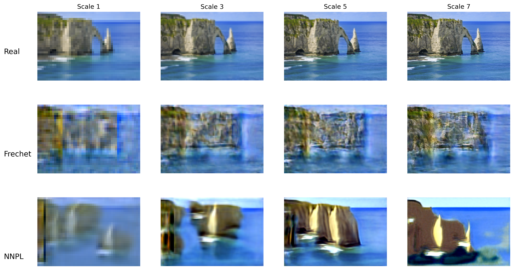

# SinGAN : Learning a Generative Model from a Single Image

This repository contains an implementation and extension of SinGAN, a generative adversarial network trained on a single natural image.  
The project was developed in the context of the "MVA : Deep Learning" course and explores alternatives to the traditional discriminator-based training.

SinGAN learns the *internal patch statistics* of a single image by training a pyramid of generators at multiple scales.  
Each generator refines the output of the previous (coarser) scale using injected noise.

In addition to reproducing the original SinGAN framework, this project explores substitute discriminator losses that remove the need for an explicit discriminator network.

## Key Contributions

- Re-implementation of the original SinGAN architecture  
- Study of hyperparameters (scaling factor, padding, number of scales)   
- Replacement of discriminators with alternative loss functions:
  - Fréchet Distance Loss
  - Nearest Neighbor Patch Loss (NNPL)
  - Aligned NN Patch Loss

